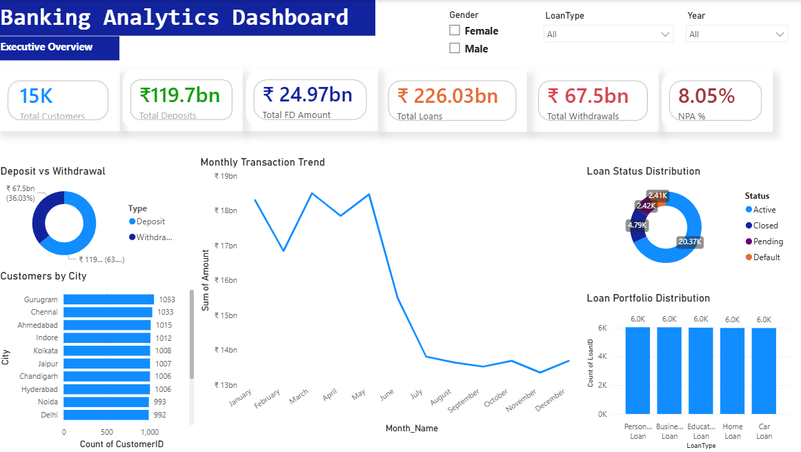
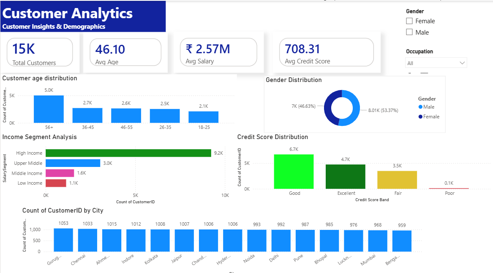
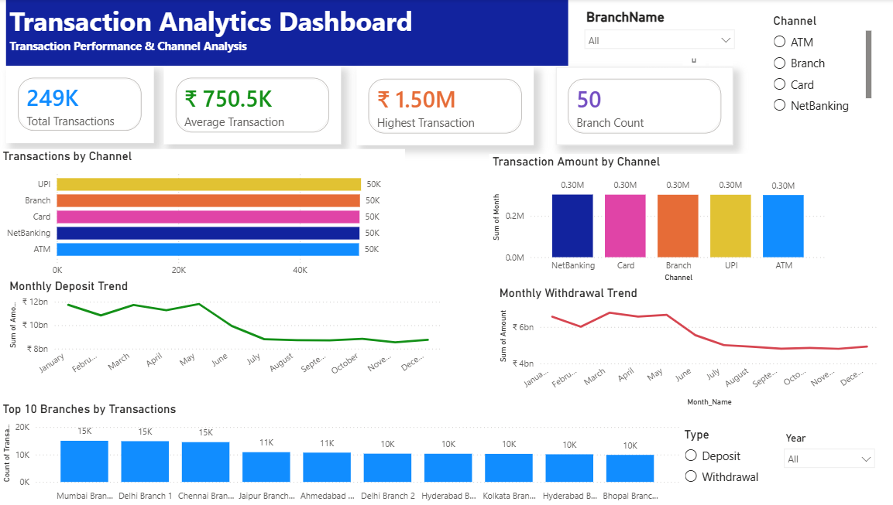
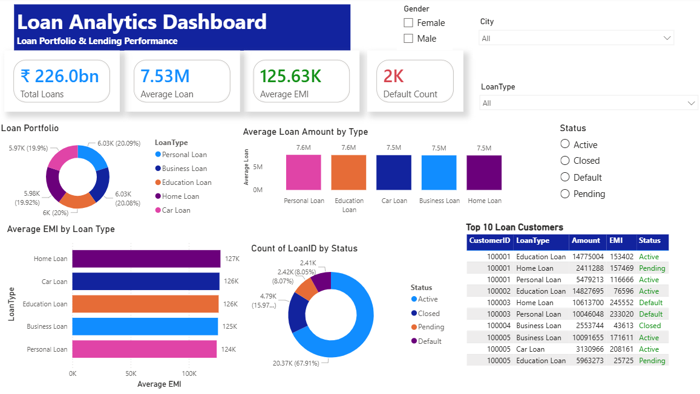
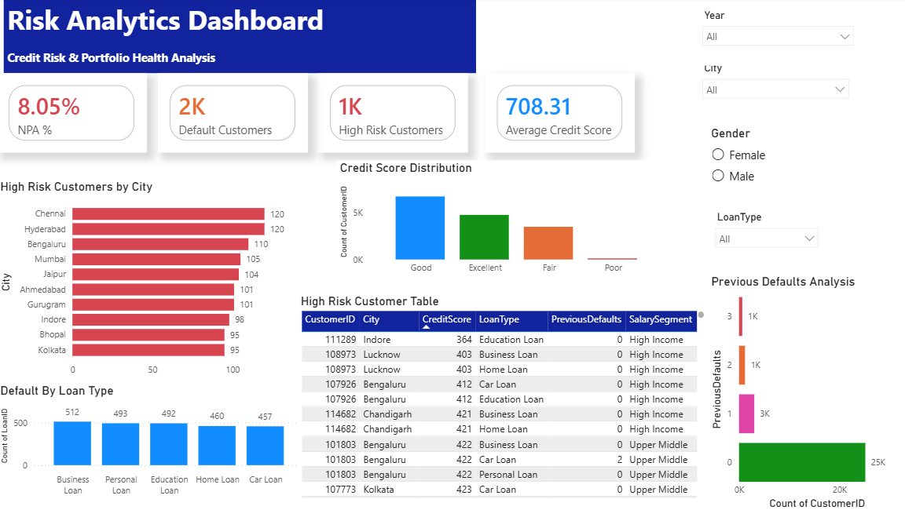

# 🏦 Banking Analytics Dashboard

An interactive **Banking Analytics Dashboard** built using **Power BI** to analyze banking operations, customer demographics, transactions, loan performance, and credit risk. This dashboard helps stakeholders monitor KPIs, identify trends, and make data-driven decisions.

---

# 📌 Project Overview

This project demonstrates end-to-end data analysis using Power BI, including:

- Data Cleaning using Power Query
- Data Modeling
- DAX Measures
- Interactive Dashboard Design
- Business KPI Analysis
- Risk Analytics

The dashboard consists of **5 interactive report pages** with slicers for dynamic filtering.

---

# 🛠️ Tools & Technologies

- Power BI Desktop
- Power Query
- DAX (Data Analysis Expressions)
- Microsoft Excel
- Data Modeling

---

# 📊 Dashboard Preview

## 1️⃣ Executive Overview



### KPIs
- Total Customers
- Total Deposits
- Total Fixed Deposits
- Total Loans
- Total Withdrawals
- NPA %

### Visuals
- Deposit vs Withdrawal
- Monthly Transaction Trend
- Loan Status Distribution
- Customers by City

---

## 2️⃣ Customer Analytics



### KPIs
- Total Customers
- Average Age
- Average Salary
- Average Credit Score

### Visuals
- Customer Age Distribution
- Gender Distribution
- Income Segment Analysis
- Credit Score Distribution
- Customers by City

---

## 3️⃣ Transaction Analytics



### KPIs
- Total Transactions
- Average Transaction
- Highest Transaction
- Branch Count

### Visuals
- Transactions by Channel
- Transaction Amount by Channel
- Monthly Deposit Trend
- Monthly Withdrawal Trend
- Top 10 Branches

---

## 4️⃣ Loan Analytics



### KPIs
- Total Loans
- Average Loan Amount
- Average EMI
- Default Customers

### Visuals
- Loan Portfolio Distribution
- Average Loan Amount by Type
- Average EMI by Loan Type
- Loan Status Distribution
- Top 10 Loan Customers

---

## 5️⃣ Risk Analytics



### KPIs
- NPA %
- Default Customers
- High Risk Customers
- Average Credit Score

### Visuals
- High Risk Customers by City
- Credit Score Distribution
- Default by Loan Type
- Previous Defaults Analysis
- High Risk Customer Table

---

# 🎯 Dashboard Features

- Interactive Slicers
- Dynamic KPI Cards
- Professional Dashboard Layout
- Drill-down Analysis
- Cross-filtering Between Visuals
- Banking Performance Monitoring
- Credit Risk Analysis

---

# 📈 Business Insights

- Monitor overall banking performance.
- Analyze customer demographics and income segments.
- Compare deposits and withdrawals over time.
- Evaluate loan portfolio performance.
- Identify high-risk customers.
- Track Non-Performing Assets (NPA).
- Analyze transaction channels and branch performance.

---

# 📂 Repository Structure

```
Banking-Analytics-Project
│
├── Banking_Project.pbix
├── README.md
├── Dataset_Screenshots
│   ├── Page1_Executive_Overview.png
│   ├── Page2_Customer_Analytics.png
│   ├── Page3_Transaction_Analytics.png
│   ├── Page4_Loan_Analytics.png
│   └── Page5_Risk_Analytics.png
│
└── Dataset
    └── Banking_Data.xlsx
```

---

# 🚀 How to Use

1. Download the repository.
2. Open `Banking_Project.pbix` using Power BI Desktop.
3. Refresh the dataset if required.
4. Explore all dashboard pages using the interactive slicers.

---

# 👨‍💻 Author

**Shivam**

Aspiring Data Analyst | Power BI | SQL | Excel | DAX

---

⭐ If you found this project useful, feel free to star the repository.
